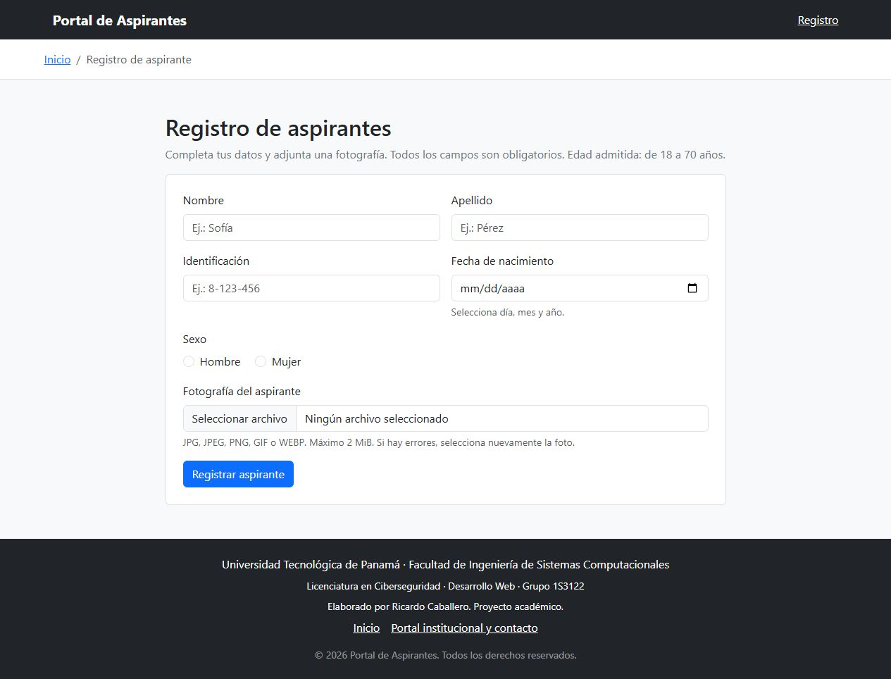
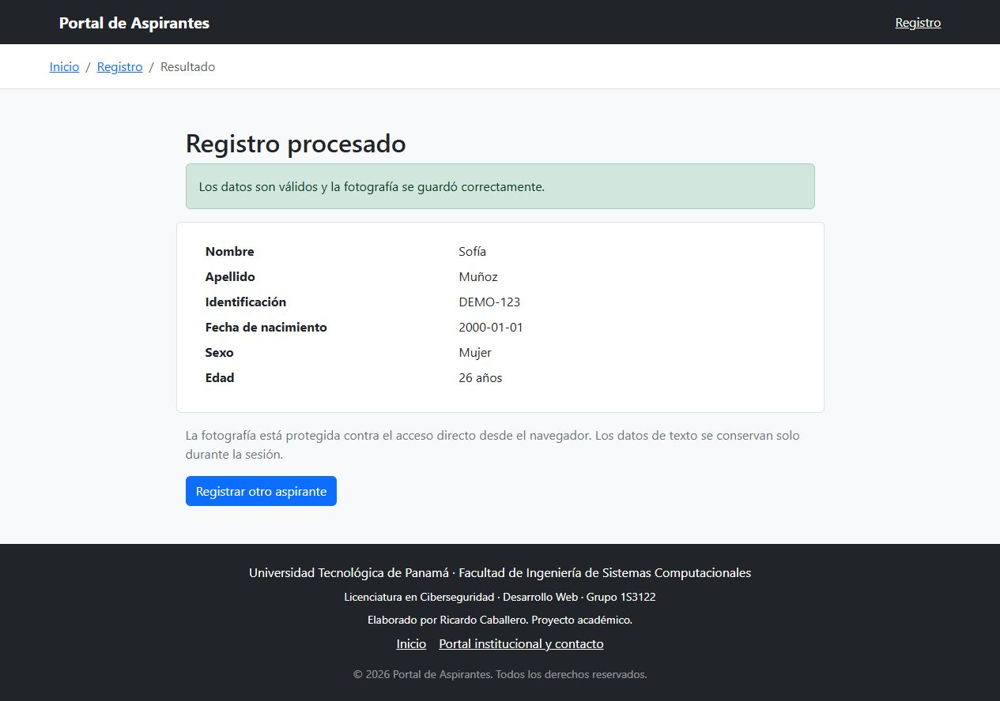
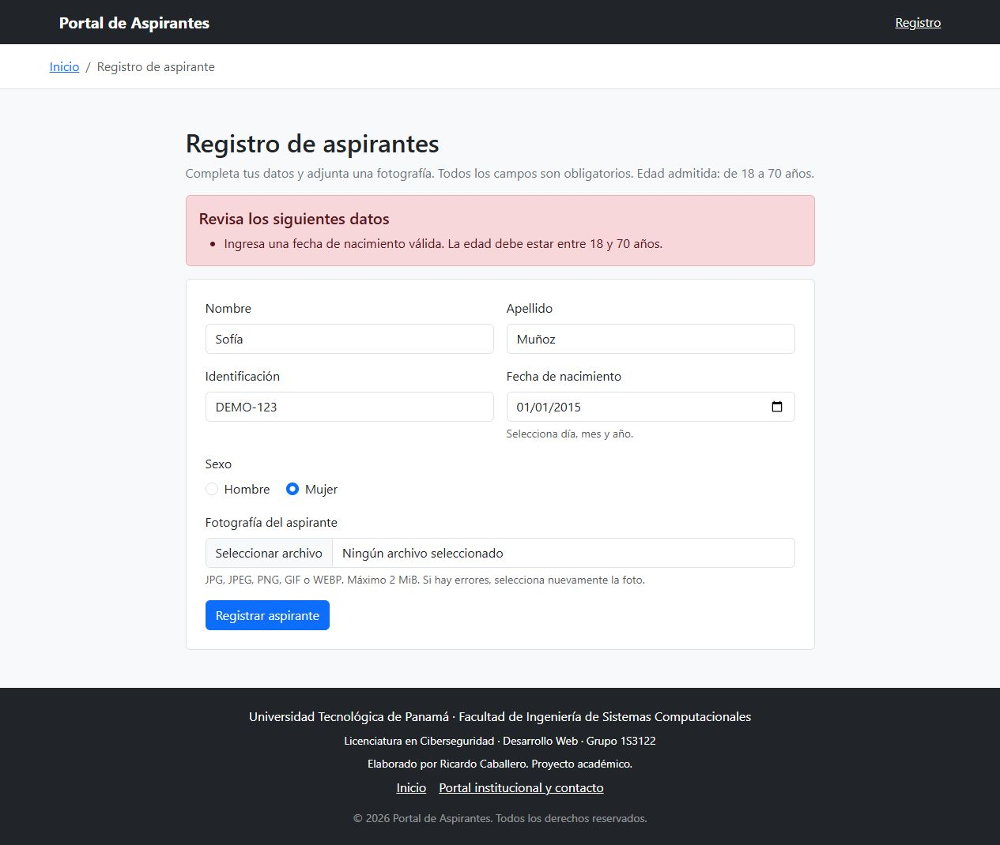
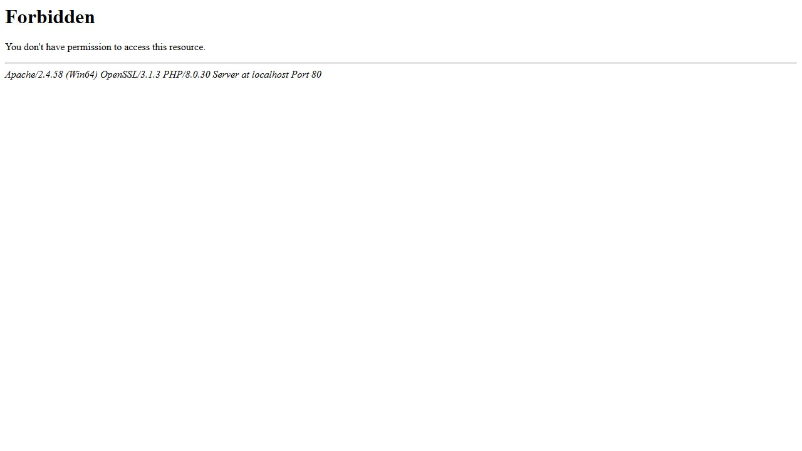

# Laboratorio #3: Registro de aspirantes

Solución de estudio basada en las 20 diapositivas de Laboratorio #3.pptx.
Fecha de realización: 01/10/2026.
Cierre de Moodle: 02/10/2026 a las 00:00.

## Autor y Contexto

- Autor: Ricardo Caballero
- Institución: Universidad Tecnológica de Panamá (UTP)
- Fecha de realización: 01/10/2026
- Carrera: Licenciatura en Ciberseguridad
- Grupo: 1S3122
- Asignatura: Desarrollo Web
- Docente: Ing. Irina Fong
- Repositorio: https://github.com/Nimbus2663/laboratorio-3-aspirantes

Documentación organizada según «Directrices para entrega del Repositorio.pdf», consultado en Moodle. Repositorio publicado en GitHub.

## Contenido del Repositorio

Crear un formulario HTML5 con Bootstrap 5.3.8 y procesarlo con PHP, utilizando validación del lado del servidor, componentes compartidos y carga de fotografías sin base de datos.

## Tecnologías Utilizadas

- Lenguaje del servidor: PHP (probado con 8.0.30), extensiones mbstring y fileinfo.
- Interfaz: HTML5 y Bootstrap 5.3.8.
- Servidor local: XAMPP con Apache 2.4.58.
- Base de datos: no se utiliza. Las fotos se guardan en disco y los datos de texto en la sesión.
- Control de versiones previsto: Git y GitHub. El repositorio está publicado.

## Capturas de Pantalla y Problemas

### Interfaz Principal: registro de aspirantes

Formulario con campos obligatorios, etiquetas semánticas, menú y migas de pan mediante include. El pie de página identifica al autor y muestra el año dinámico.



### Procesamiento y normalización

Se envían datos ficticios y una imagen PNG de prueba. PHP convierte SOFÍA y MUÑOZ a Sofía y Muñoz, calcula la edad y confirma que guardó el archivo. La imagen utilizada verifica la carga y no representa una persona real.



### Validación de edad

Una fecha de nacimiento del 01/01/2015 provoca el rechazo del registro porque no alcanza los 18 años. El formulario conserva los textos y permite corregirlos.



### Protección de fotografías

Apache devuelve 403 Forbidden al solicitar directamente la carpeta uploaded_files. La regla Require all denied también bloquea los archivos individuales.



## Estructura de Carpetas o Directorios

```text
TallerAspirantes/
  index.php                 Formulario y errores
  procesar.php              Validación, carga y resultado
  router.php                Enrutador para el servidor de desarrollo
  includes/
    formulario.php          Formulario incluido desde index.php
    funciones.php           Sesión, escape, normalización y edad
    header.php              Metadatos, menú y migas de pan
    footer.php              Identidad, contacto y año dinámico
    .htaccess               Bloqueo de solicitudes directas
  uploaded_files/
    .htaccess               Bloqueo de todas las solicitudes HTTP
    .gitkeep
  docs/capturas/            Evidencias del formulario, resultado y validaciones
  .gitignore
  README.md
```

## Instrucciones de Ejecución / Uso

### Ejecución con XAMPP o WAMP

Descarga y descomprime el ZIP. Cuando el repositorio esté publicado, también podrás clonarlo mediante `git clone URL_DEL_REPOSITORIO`, reemplazando ese marcador por su dirección real.

1. Copia la carpeta TallerAspirantes en `C:\xampp\htdocs\` o `C:\wamp64\www\`.
2. Activa Apache. No hace falta MySQL.
3. Abre `http://localhost/TallerAspirantes/`.
4. Comprueba que PHP tenga habilitadas `mbstring` y `fileinfo`, y que Apache pueda escribir en `uploaded_files`.
5. En php.ini configura `file_uploads=On`, `upload_max_filesize=2M` o superior y `post_max_size=8M` o superior. Reinicia Apache si cambias php.ini.
6. Apache 2.4 debe aplicar `.htaccess` (por ejemplo `AllowOverride AuthConfig` o `AllowOverride All` en el directorio correspondiente). Antes de cargar fotos personales, verifica que tanto `/uploaded_files/` como la URL de una foto de prueba devuelvan 403. Los nombres aleatorios y `noindex` no sustituyen esta protección.

Se probó el código con PHP 8.0.30 disponible en este equipo. Para otros entornos utiliza una versión de PHP con soporte vigente. Bootstrap se carga desde CDN y requiere conexión a Internet para sus estilos.

### Alternativa de desarrollo sin activar Apache

Desde PowerShell, ubicado en la carpeta del proyecto:

```powershell
& C:\xampp\php\php.exe -S 127.0.0.1:8080 router.php
```

Abre `http://127.0.0.1:8080/`. Detén el servidor con Ctrl+C. Es indispensable incluir `router.php`: el servidor integrado de PHP ignora `.htaccess`. El router solo permite las dos páginas públicas.

## Cómo funciona, paso a paso

1. `index.php` carga las funciones y usa `include` para el header y footer. Dentro de `main > section` incluye `includes/formulario.php`.
2. `method="post"` envía los datos a `procesar.php`. `enctype="multipart/form-data"` permite enviar la foto. GET se usa para abrir las páginas y consultar el resultado de la sesión.
3. `campo()` verifica que cada valor sea texto y aplica `trim()` y `strip_tags()`. La validación en PHP se ejecuta aunque el usuario omita las restricciones HTML.
4. `mb_convert_case(..., MB_CASE_TITLE, 'UTF-8')` normaliza nombres con tildes. Es la alternativa Unicode a `ucwords(strtolower(...))`. `strtoupper()` normaliza la identificación.
5. `DateTimeImmutable` verifica la fecha exacta y calcula años cumplidos. Acepta 18 y 70, rechaza menores de 18, personas de 71 o más, fechas futuras e imposibles.
6. La foto debe llegar mediante una carga HTTP válida, pesar como máximo 2 MiB y tener extensión y MIME compatibles. También se comprueba la cabecera de imagen y el límite de dimensiones. No se acepta SVG ni PHP.
7. `basename()` extrae el nombre final antes de revisar la extensión. `random_bytes()` crea un nombre nuevo, y `move_uploaded_file()` guarda la foto en `uploaded_files`.
8. Una redirección 303 permite consultar el resultado por GET sin repetir la carga al actualizar. Solo se guarda la fotografía en disco; los textos permanecen en la sesión. No hay base de datos ni listado permanente de aspirantes.
9. `htmlspecialchars()` escapa todos los valores mostrados para evitar que se interpreten como HTML. El token CSRF vincula el envío a la sesión del formulario.

La función de mayúsculas no agrega tildes: `sofía` se convierte en `Sofía`, pero `sofia` se convierte en `Sofia`. La tilde debe venir del dato ingresado. El ejemplo de las diapositivas simplifica este detalle.

## Correspondencia con la rúbrica

| Requisito | Implementación |
| --- | --- |
| Bootstrap y HTML semántico | header.php, index.php, procesar.php, footer.php |
| Formulario dentro de main y section | index.php |
| Menú y migas de pan con include | includes/header.php, basename e if |
| Nombre, apellido, identificación, fecha, sexo y foto obligatorios | index.php y validación en procesar.php |
| Edad de 18 a 70 años | edadDesdeFecha y condiciones en procesar.php |
| Nombre y apellido tipo título | nombreTitulo |
| Extensiones jpg, jpeg, png, gif y webp | mapa de tipos permitidos |
| Foto guardada sin base de datos | move_uploaded_file |
| Carpeta inaccesible por navegador | uploaded_files/.htaccess o router.php |
| Footer modular y año dinámico | includes/footer.php y date('Y') |
| README y repositorio | Esta guía en Markdown, capturas y .gitignore; publicado en GitHub |

## Pruebas que puedes demostrar

- Registro válido con una foto real: muestra los datos normalizados y crea un archivo de nombre aleatorio.
- Persona que cumple 18 hoy: aceptada. Quien cumple 18 mañana: rechazada.
- Persona de 70 años: aceptada. Persona que cumple 71 hoy: rechazada.
- Campos vacíos, fecha futura o fecha como 2026-02-30: rechazados.
- Texto o código renombrado como .jpg: rechazado.
- Foto mayor de 2 MiB o extensión no admitida: rechazada.
- Acceso directo a carpeta y a foto: 403.
- Actualizar resultado: no crea otra copia de la foto.
- Nombre con tildes en mayúsculas: se conserva la tilde al normalizar.

Usa datos ficticios y una imagen de prueba para las evidencias. No subas fotos personales al repositorio. Las capturas incluidas se obtuvieron de la instalación local con datos ficticios.

## Referencias

- Enunciado: Laboratorio #3.pptx, diapositivas 4–20.
- Directrices para entrega del Repositorio.pdf, páginas 1 y 2, Moodle de Desarrollo Web.
- Bootstrap: https://getbootstrap.com/docs/5.3/getting-started/introduction/
- Carga de archivos PHP: https://www.php.net/manual/en/function.move-uploaded-file.php
- Normalización Unicode: https://www.php.net/manual/en/function.mb-convert-case.php
- Escape HTML: https://www.php.net/manual/en/function.htmlspecialchars.php
- Autorización Apache: https://httpd.apache.org/docs/2.4/mod/mod_authz_core.html#require

## Actualización del 07/10/2026

El formulario está separado en `includes/formulario.php` y se carga mediante `include` desde `index.php`, al igual que la navegación y el pie de página. Se conserva el funcionamiento del registro.

## Verificación realizada

Los ocho archivos PHP pasaron la comprobación de sintaxis. En el servidor integrado de PHP con router se comprobaron el registro con foto, la normalización, la actualización sin duplicados, cinco rutas bloqueadas y diez envíos inválidos. Se comprobaron además ocho casos de fechas y Unicode. El 1 de octubre de 2026 se instaló también en C:\xampp\htdocs\TallerAspirantes y se probó con Apache: registro correcto, normalización, actualización sin duplicar fotografías, diez envíos inválidos y bloqueo HTTP 403 de uploaded_files, una foto real de prueba e includes. No fue necesario cambiar la configuración de Apache.
